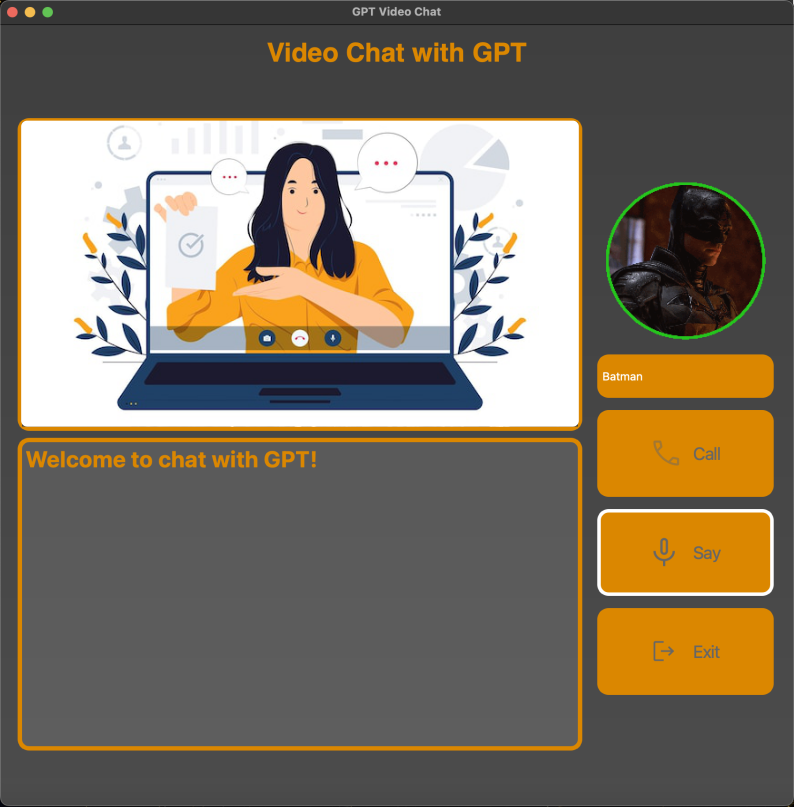

# Videochat with ChatGPT

**The Videochat application written in Python to speak with ChatGPT.**


_Demonstration of GUI of the application_

---

## Table of contents

1. [Project description](#project-description)
2. [Application screenshots](#application-screenshots) 
3. [Roles](#roles)
4. [Technologies used](#technologies-used)
5. [Installation](#installation)

---

## Project Description

The project will include usage of three artificial intelligences - one is the Elevenlabs Text-To-Speech API, the second is ChatGPT and the third one is an object recognition model from Tensorflow, which called *ssd_mobilenet_v2_coco_2018_03_29* which will be used locally([Model repo](https://github.com/Qengineering/MobileNet_SSD_OpenCV_TensorFlow/tree/master)).

This app will allow user to speak with ChatGPT by his voice, and show certain object to chatgpt and get respond played as a robotic voice.


---

## Application screenshots




---

## Roles

You can call to the ChatGPT and he will play pretend with different roles. 

The list of roles:
+ Crusader
+ Mike Tyson
+ Eminem
+ Batman/Batman Rogue
+ Crackhead
+ Kaufland Employee


Each role will have it's own character, which ChatGPT4 will try to play, and speak in it's manner.

Also, local instance of model on your PC will recognize objects on your camera and send this information to ChatGPT, creating illusion, that you speak in video call, and according to role choosen - ChatGPT will react on these objects.

---

## Technologies used

The required technologies:
  + PySide6 for GUI creation
  + Tensorflow object recognition model
    - COCO names for that model
  + ChatGPT API
  + SpeechRecognition
  + Elevenlabs API
  + OpenCV for camera access and image processing

---
## Installation

1. This application is written in Python, so the first thing you have to have is Python interpreter installed on your machine. You can find latest installation on [Python official site](https://www.python.org/downloads/).
2. Secondly, you'll need to create Python venv to isolate all the packages required for the project.

    To do so, you have to open up your Terminal and navigate to folder with application installed with `cd` command. After that, use a command:
    ```bash
    python3 -m venv AppEnv
    ```
    > In case of Ubuntu usage, first run: `sudo apt-get install python3-venv`

    This command will create isolated Python environment.
  3. Next you'll need to activate newly created environment with command:
      ```bash
      source AppEnv/bin/activate
      ``` 
  4. Now you'll need to install all dependencies with command:
      ```bash
      pip3 install -r requirements.txt
      ```
5. And when the installation is completed successfuly - you can **run the app**.

    To do that - run following command:
    ```bash
    python3 app.py
    ```
---

## Have fun!